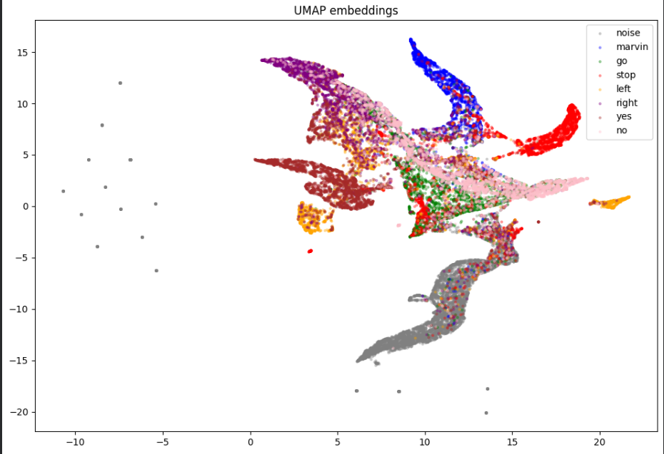
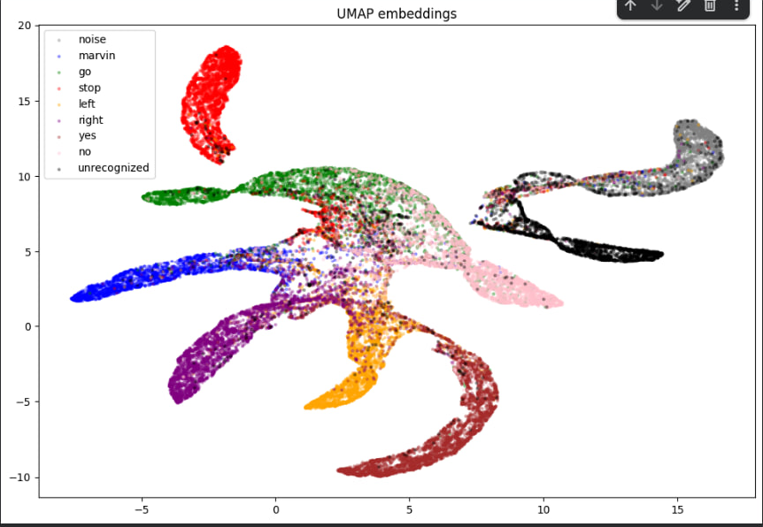
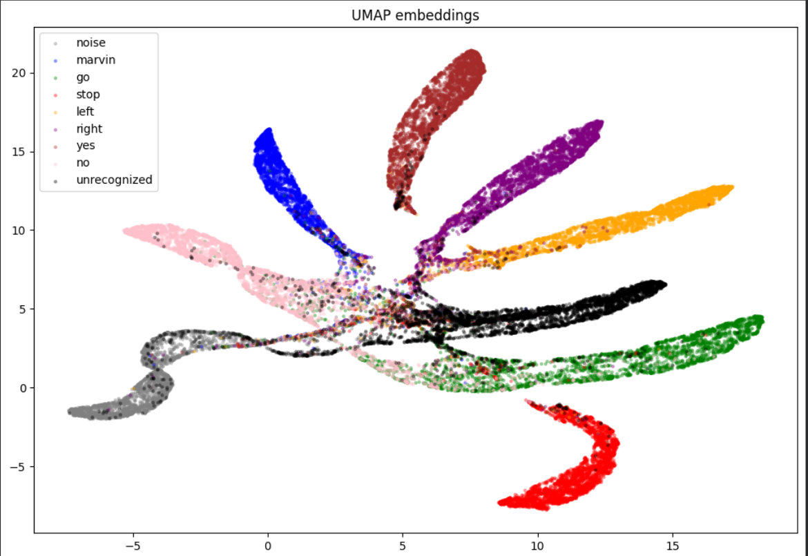
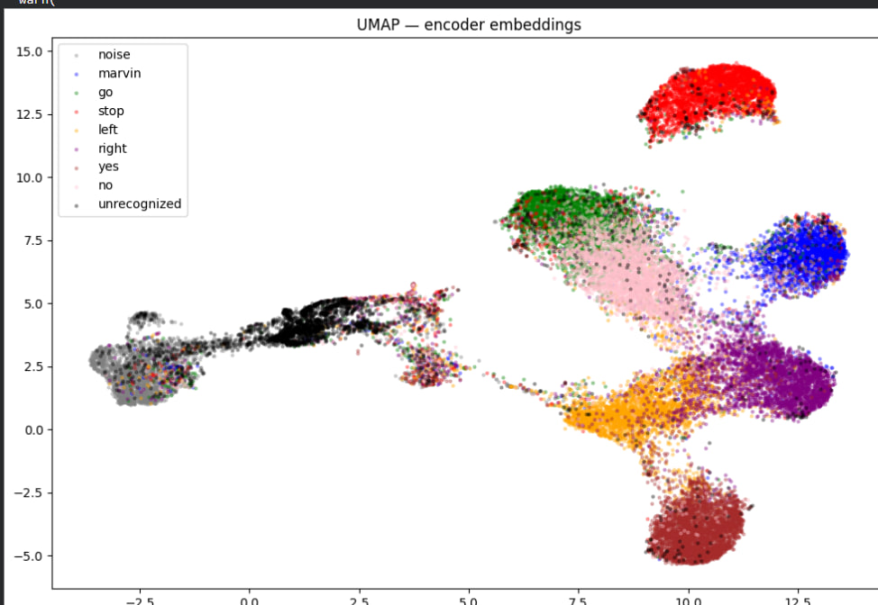
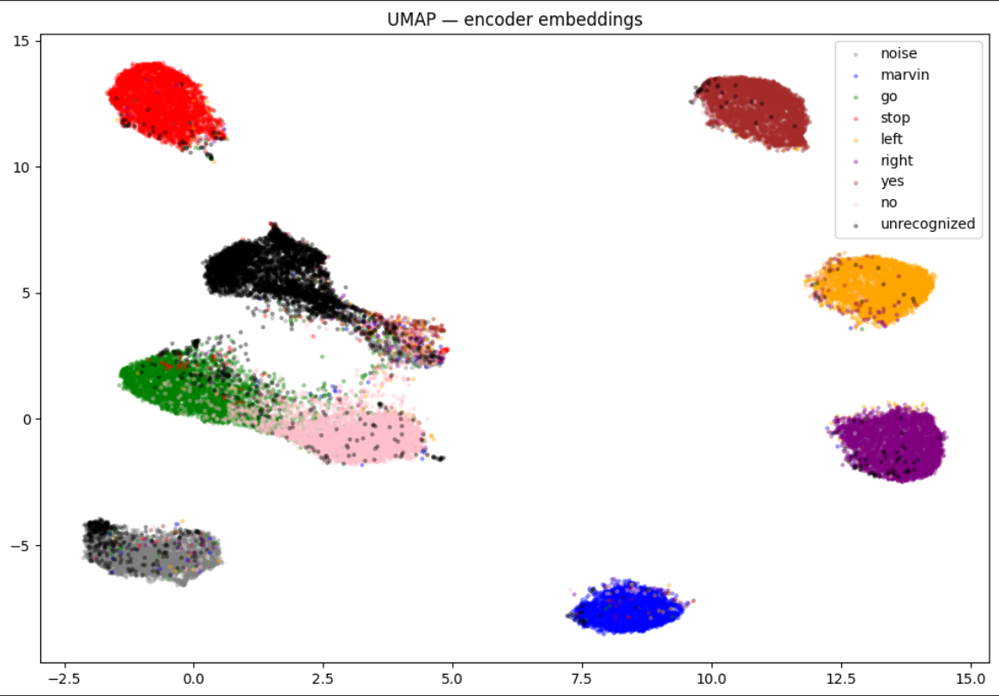
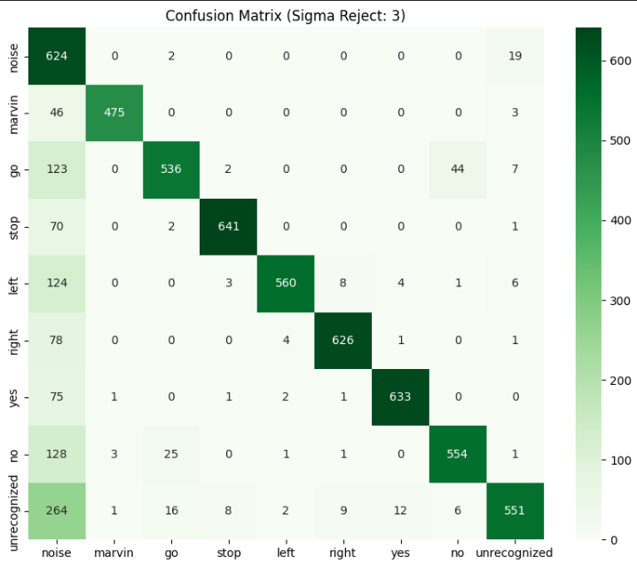

<H1>Keyword detection</H1>

Hi, my name is Mykyta

This is my keyword detection project. My goal is to achieve a high accuracy in recognizing 7 keywords
and then implement this model into a demo game about a dog (where dog is another RL model). For the purposes of deploying it in a game, I've tried to avoid giant architectures and used a few dilated convolutional blocks, GlobalAveragePooling and Dense output with softmax activation function. Data was collected from Google Speech Commands, noise audio data (Kaggle), Mozilla Common Voice Ukrainian dataset and my own samples from another project. 
Stack used: TensorFlow/Keras, TFLite, FastAPI, UMAP, scikit-learn. Two versions of a model are implemented: purely encoder (used in server.py) and encoder + softmax-based classificator (used in server2.py). For inference run gui.py and one of those using uv.

.venv\Scripts\activate
uv run server.py
uv run server2.py
uv run gui.py

Classes:
0 - noise
1 - marvin
2 - go
3 - stop
4 - left
5 - right
6 - yes
7 - no

keyword_v2.tflite is a CNN with dilated blocks trained on roughly 37000 samples. 
Architecture:

Click to view Model Architecture Table

┏━━━━━━━━━━━━━━━━━━━━━┳━━━━━━━━━━━━━━━━━━━┳━━━━━━━━━━━━┳━━━━━━━━━━━━━━━━━━━┓
┃ Layer (type)        ┃ Output Shape      ┃    Param # ┃ Connected to      ┃
┡━━━━━━━━━━━━━━━━━━━━━╇━━━━━━━━━━━━━━━━━━━╇━━━━━━━━━━━━╇━━━━━━━━━━━━━━━━━━━┩
│ input_layer         │ (None, 64, 128,   │          0 │ -                 │
│ (InputLayer)        │ 1)                │            │                   │
├─────────────────────┼───────────────────┼────────────┼───────────────────┤
│ conv2d (Conv2D)     │ (None, 64, 128,   │        160 │ input_layer[0][0] │
│                     │ 16)               │            │                   │
├─────────────────────┼───────────────────┼────────────┼───────────────────┤
│ max_pooling2d       │ (None, 32, 64,    │          0 │ conv2d[0][0]      │
│ (MaxPooling2D)      │ 16)               │            │                   │
├─────────────────────┼───────────────────┼────────────┼───────────────────┤
│ conv2d_1 (Conv2D)   │ (None, 32, 64,    │      4,640 │ max_pooling2d[0]… │
│                     │ 32)               │            │                   │
├─────────────────────┼───────────────────┼────────────┼───────────────────┤
│ conv2d_2 (Conv2D)   │ (None, 32, 64,    │      4,640 │ max_pooling2d[0]… │
│                     │ 32)               │            │                   │
├─────────────────────┼───────────────────┼────────────┼───────────────────┤
│ conv2d_3 (Conv2D)   │ (None, 32, 64,    │      4,640 │ max_pooling2d[0]… │
│                     │ 32)               │            │                   │
├─────────────────────┼───────────────────┼────────────┼───────────────────┤
│ concatenate         │ (None, 32, 64,    │          0 │ conv2d_1[0][0],   │
│ (Concatenate)       │ 96)               │            │ conv2d_2[0][0],   │
│                     │                   │            │ conv2d_3[0][0]    │
├─────────────────────┼───────────────────┼────────────┼───────────────────┤
│ conv2d_4 (Conv2D)   │ (None, 32, 64,    │      3,104 │ concatenate[0][0] │
│                     │ 32)               │            │                   │
├─────────────────────┼───────────────────┼────────────┼───────────────────┤
│ max_pooling2d_1     │ (None, 16, 32,    │          0 │ conv2d_4[0][0]    │
│ (MaxPooling2D)      │ 32)               │            │                   │
├─────────────────────┼───────────────────┼────────────┼───────────────────┤
│ conv2d_5 (Conv2D)   │ (None, 16, 32,    │     18,496 │ max_pooling2d_1[… │
│                     │ 64)               │            │                   │
├─────────────────────┼───────────────────┼────────────┼───────────────────┤
│ conv2d_6 (Conv2D)   │ (None, 16, 32,    │     18,496 │ max_pooling2d_1[… │
│                     │ 64)               │            │                   │
├─────────────────────┼───────────────────┼────────────┼───────────────────┤
│ conv2d_7 (Conv2D)   │ (None, 16, 32,    │     18,496 │ max_pooling2d_1[… │
│                     │ 64)               │            │                   │
├─────────────────────┼───────────────────┼────────────┼───────────────────┤
│ concatenate_1       │ (None, 16, 32,    │          0 │ conv2d_5[0][0],   │
│ (Concatenate)       │ 192)              │            │ conv2d_6[0][0],   │
│                     │                   │            │ conv2d_7[0][0]    │
├─────────────────────┼───────────────────┼────────────┼───────────────────┤
│ conv2d_8 (Conv2D)   │ (None, 16, 32,    │     12,352 │ concatenate_1[0]… │
│                     │ 64)               │            │                   │
├─────────────────────┼───────────────────┼────────────┼───────────────────┤
│ max_pooling2d_2     │ (None, 8, 16, 64) │          0 │ conv2d_8[0][0]    │
│ (MaxPooling2D)      │                   │            │                   │
├─────────────────────┼───────────────────┼────────────┼───────────────────┤
│ batch_normalization │ (None, 8, 16, 64) │        256 │ max_pooling2d_2[… │
│ (BatchNormalizatio… │                   │            │                   │
├─────────────────────┼───────────────────┼────────────┼───────────────────┤
│ global_average_poo… │ (None, 64)        │          0 │ batch_normalizat… │
│ (GlobalAveragePool… │                   │            │                   │
├─────────────────────┼───────────────────┼────────────┼───────────────────┤
│ dropout (Dropout)   │ (None, 64)        │          0 │ global_average_p… │
├─────────────────────┼───────────────────┼────────────┼───────────────────┤
│ dense (Dense)       │ (None, 64)        │      4,160 │ dropout[0][0]     │
├─────────────────────┼───────────────────┼────────────┼───────────────────┤
│ embedding_output    │ (None, 64)        │          0 │ dense[0][0]       │
│ (Lambda)            │                   │            │                   │
├─────────────────────┼───────────────────┼────────────┼───────────────────┤
│ dense_1 (Dense)     │ (None, 8)         │        520 │ embedding_output… │
└─────────────────────┴───────────────────┴────────────┴───────────────────┘

 Total params: 89,960 (351.41 KB)

 Trainable params: 89,832 (350.91 KB)

 Non-trainable params: 128 (512.00 B)

 

 

Testing results are as following:

                 precision    recall  f1-score   support

       noise       0.83      1.00      0.90      8966
      marvin       0.99      0.87      0.92      2794
          go       0.95      0.82      0.88      3795
        stop       0.99      0.93      0.96      3808
        left       0.92      0.90      0.91      3765
       right       0.95      0.91      0.93      3787
         yes       0.97      0.92      0.95      3803
          no       0.90      0.84      0.87      3800

    accuracy                           0.91     34518
    macro avg      0.94      0.90      0.92     34518
    weighted avg   0.92      0.91      0.91     34518

But once I've had launched the model I have spotted the inconsistency - it could recognize keywords perfectly, understood what a noise is, but couldn't easily distinguish between ordinary speech and target words. Thus I have added samples from Mozilla Common Voice and created another class - 'unrecognized'. Of course there was no aim to distinguish it perfectly, but this class, higher dilation of convolutional layers and cyclic learning rate schedule to escape local minima led to sharpening of word embeddings. Let us compare.

Softmax results reduced with UMAP without Common Voice

Softmax results with Common Voice

Softmax results with higher dilation rate and callbacks

Embeddings with Common Voice

Embeddings with higher dilation rate and callbacks

Using these techniques, it was possible to acquire the following results on test data

              precision    recall  f1-score   support

       noise       0.41      0.97      0.57       645
      marvin       0.99      0.91      0.95       524
          go       0.92      0.75      0.83       712
        stop       0.98      0.90      0.94       714
        left       0.98      0.79      0.88       706
       right       0.97      0.88      0.92       710
         yes       0.97      0.89      0.93       713
          no       0.92      0.78      0.84       713
unrecognized       0.94      0.63      0.76       869

    accuracy                           0.82      6306
   macro avg       0.90      0.83      0.85      6306
weighted avg       0.90      0.82      0.84      6306

Model architecture is almost the same since higher dilation doesn't increase the number of parameters.

They are a bit worse than the previous results, yet the model, in fact, works better, recognizing words better and distinguishing between them. Low noise precision for noise is expected — unrecognized speech now falls into noise class by design, acting as a rejection mechanism.

